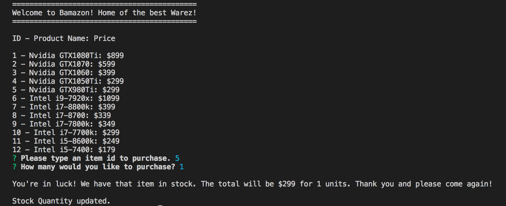
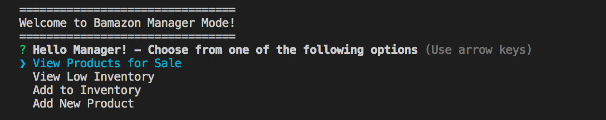
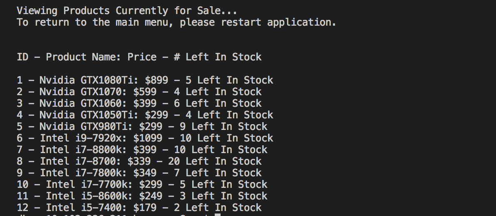
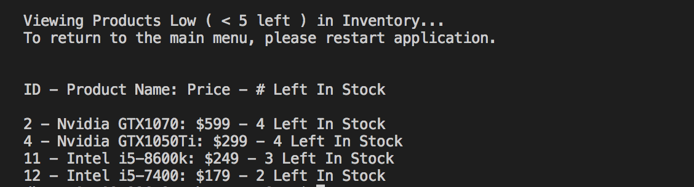
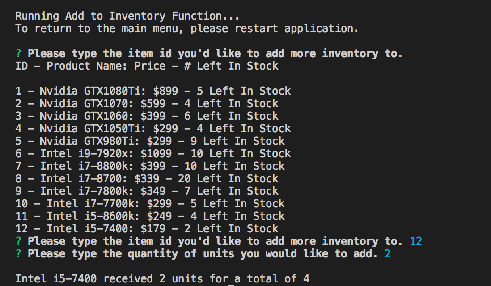
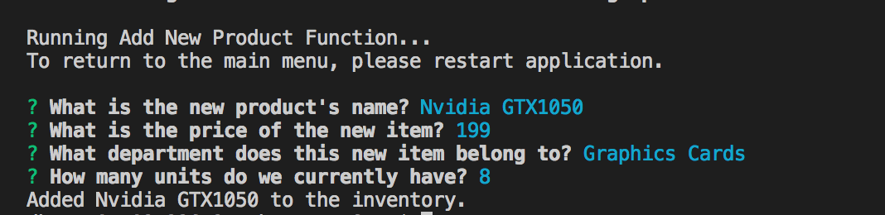

# bamazon

An Amazon-like storefront using MySQL and Node.js
This interactive shopping application is used to allow users to purchase items as a customer, and also view, track, and update the product inventory as a manager.

***

### Bamazon: Customer

Using this application as a customer will allow the user to view the current items available for purchsae. Upon the process of purchasing, the user will be prompted to enter an item id and amount of the item they would like to purchase. The application will check if there is enough stock of the item and will let the user know if there is or isn't enough in stock. If there is, then the user will see the total amount of their purchase.

***

### Bamazon: Manager

The Bamazon manager application will allow the manager to view and edit the inventory of the store. The manager will choose one of the following options:
* View products for sale
* View low inventory items
* Add to inventory
* Add a new product

##### Viewing Products For Sale

This option allows the user to view the products available for sale, which department the item belongs to, it's price, and how many is left in stock.

##### Viewing Low Inventory Products

This option allows the user to see a list of products that have quantities less than 5 in stock.

##### Adding Units to Inventory

This option allows the user to update the inventory of a specific product. The user will be prompted to input the item id the user wants to add inventory to. The second prompt will ask how many of the specified item the user wants to increase the quantity by.

##### Adding New Products to the Store

This option allows the user to add a new product to the store. The user will be prompted for the product name, department it belongs to, as well as the price and quantity of stock. It will be added to the database.

***

### Technologies

* Javascript
* Node.js
* MySQL
* npm packages:
    - mysql
    - inquirer

***

### License

This application was written by Sean Arca
Copyright 2018 - Northwestern University Coding Bootcamp & Sean Arca